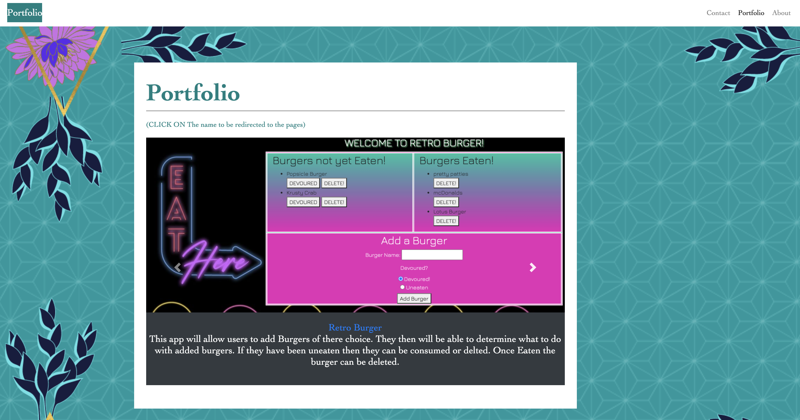

 # reactPortfolio
* ReadMe Generator

# Table Of Content:
* [Project_Description](#Project_Description)
* [Project_Installation_Instructions](#Project_Installation_Instructions)
* [Project_Usage](#Project_Usage)
* [Project_Contributors](#Project_Contributors)
* [Project_Test](#Project_Test)
* [License](#Project_license)
* [Contact_Information](#Contact_Information)

# Project_Description
* My personal portfolio created with React.
  This page will be used to learn more information on the developer. 
  After Viewing the page the following will be know:
*   Who is the developer as well as their image via the About Tab.
*   A way to leave your  contact information so the developer may reach out via the Contact Tab. 
*   As well as current projects they are working on via the Portfolio Tab.

# Project_Installation_Instructions
  There is no installation required for this page, all files can be viewed at the following link:
* GitHUB Repo : https://github.com/Jacqueline8996/reactPortfolio
* Live Link: https://jacqueline8996.github.io/Portfolio/

# Project_Usage
* Click on the link to view live portfolio

# Page Images 
* Images of the home page of the link 

* Resources on Me will be located here 

* Contact information can be delivered 

# Project_Contributors
* Author is the sole contributor 

# Link to projects : 
*  Figuring out how to get user input to keep them updated. 
* * Weather DashBoard: https://jacqueline8996.github.io/Homework6/
* * Project 1 (Let's Plan A Day): https://nvandenberge.github.io/LetsPlanADay/
* * Code Quiz: https://jacqueline8996.github.io/Homework4/
* * Project2 (Pokemon Card Game): https://vast-forest-11479.herokuapp.com/
* * Retro Burger: https://gentle-temple-81178.herokuapp.com/
* * Note taker: https://frozen-journey-71877.herokuapp.com/
* * Weather Dashboard: "https://jacqueline8996.github.io/Homework6/
* * Team Profile: "https://github.com/Jacqueline8996/TeamProfile"

# Project_Test
* No test for this project

# Project_License
* The_Unlicense
* 

# Link to LinkedIn:
* https://www.linkedin.com/in/jacqueline-rivera/

# Contact_Information
* If you have question or would like to contact the project creator please:
    *  Get Visit Git Hub profile at: (https://github.com/Jacqueline8996)
    *  Email at: Jacqueline8996@gmail.com